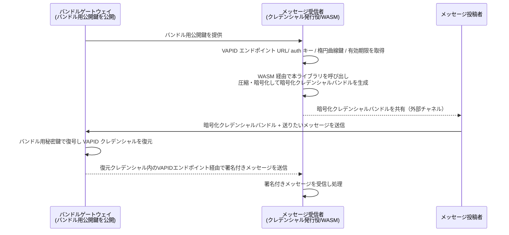

# non-resident-vapid

クライアント側で VAPID 認証鍵を暗号化し、サービスのサーバーを経由させずに別の利用者へ共有するワークフローを扱う Rust クレートの試作品です。暗号化・復号に用いるキーペアは配信サービスが持ちますが、これはあくまで「暗号化クレデンシャルバンドル」を処理するための鍵であり、VAPID 用キーペアはメッセージ受信者（クレデンシャル発行役）が提供するものを復号して利用します。サービス側には定期発行する一時的な鍵情報のみを保持させることで、WebAuthn の非常駐クレデンシャルに近いスケール特性を目指します。

## 役割
- バンドルゲートウェイ: 暗号化クレデンシャルバンドル処理用のキーペアを保持し、公開鍵を配布する。秘密鍵でバンドルを復号し、得られた VAPID クレデンシャルで署名を行う。
- メッセージ受信者（クレデンシャル発行役）: メッセージを受け取る立場として、ブラウザ上で VAPID エンドポイント URL・`auth` キー・楕円曲線暗号鍵・有効期限を取得し、本クレート（WASM 経由）で暗号化を行う。
- メッセージ投稿者: メッセージ受信者から受け取った暗号化クレデンシャルバンドルと送信したいメッセージをバンドルゲートウェイに渡す。

## 用語
- 暗号化クレデンシャルバンドル: 鍵発行者がエンドポイント URL・`auth` キー・楕円曲線暗号鍵・有効期限をまとめ、サービス公開鍵で圧縮・暗号化したデータ。本ドキュメントでは暗号化クレデンシャルバンドルと呼ぶ。

## ワークフロー概要

## 詳細フロー
1. バンドルゲートウェイは「暗号化クレデンシャルバンドル」処理用のキーペアを持ち、公開鍵を配布する（秘密鍵はサーバー内に留める）。
2. メッセージ受信者（クレデンシャル発行役）はブラウザで VAPID エンドポイント URL・`auth` キー・楕円曲線暗号鍵・有効期限を収集する。
3. メッセージ受信者は WebAssembly 経由で本クレートを呼び出し、バンドルゲートウェイの公開鍵を用いてこれらの情報を圧縮・暗号化し「暗号化クレデンシャルバンドル」を生成する。
4. メッセージ受信者は暗号化クレデンシャルバンドルをメッセージ投稿者へ外部チャネル（任意の経路）で共有する。
5. メッセージ投稿者は暗号化クレデンシャルバンドルと、メッセージ受信者へ届けたいメッセージ本文をバンドルゲートウェイへ送信する。
6. バンドルゲートウェイはバンドル用秘密鍵で暗号化クレデンシャルバンドルを復号し、得られた VAPID クレデンシャルで VAPID を実行してメッセージに署名し、ブラウザが指定する VAPID サーバー（プッシュサービス）経由でメッセージ受信者へ送信する。VAPID 秘密鍵の署名処理は TPM/HSM 等のキーストアで行い、秘密鍵素材をアプリケーションライブラリへ渡さない。
7. メッセージ受信者は署名付きプッシュメッセージを受信し、内容を処理する。

## 目標
- 送信前に VAPID 秘密鍵をクライアントで暗号化する手順を示す。
- 受信フローで暗号文を復号し、署名付きプッシュメッセージを送信できるようにする。
- サーバーが保持するデータ量を鍵ローテーション情報に限定し、長期鍵はクライアントにのみ残す。
- Web Push 系ツールに組み込みやすい Rust API を提供する。

## 想定アーキテクチャ
- `encrypt` モジュール: VAPID 鍵素材と共有ポリシーを受け取り、外部チャネルで渡せる暗号文を生成。
- `decrypt` モジュール: 暗号文を検証・復号し、Web Push 署名に使える形へ準備。
- `message` モジュール: 復号済みクレデンシャルを用いたプッシュメッセージ組み立てと送信の補助。
- `keystore` モジュール（予定）: TPM/HSM などのキーストアを経由して署名・復号 API だけを公開し、VAPID 秘密鍵素材はハードウェアに閉じ込める。
- サーバーへのアクセスは最小限とし、鍵ローテーションのメタデータのみ保持し暗号化鍵本体は保存しない。

## 使い方の流れ（今後の実装予定）
1. セッションごとに新しい VAPID 鍵ペアを生成または取得する。
2. 秘密鍵とポリシー・有効期限・宛先などのメタデータをクライアント側で暗号化する。
3. 暗号文をサービス外の任意チャネルで別ユーザーへ共有する。
4. 受信者が本クレートに暗号文を渡し、復号後にプッシュメッセージへ署名して送信する。

## ステータス
現時点では骨組みのみで、`Cargo.toml` もプレースホルダーです。次のステップとして AEAD＋署名といった暗号プリミティブの選定、上記モジュールの実装、テストおよびサンプル追加を行います。
